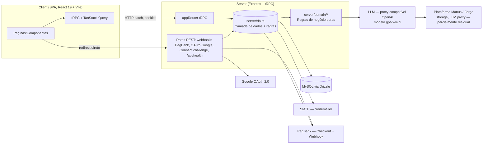
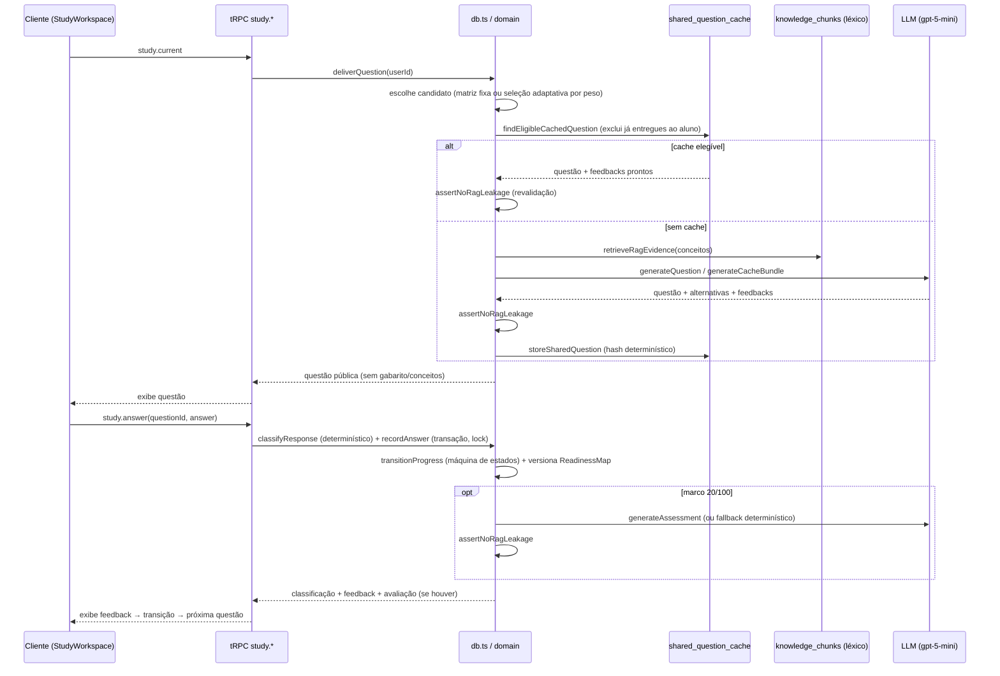
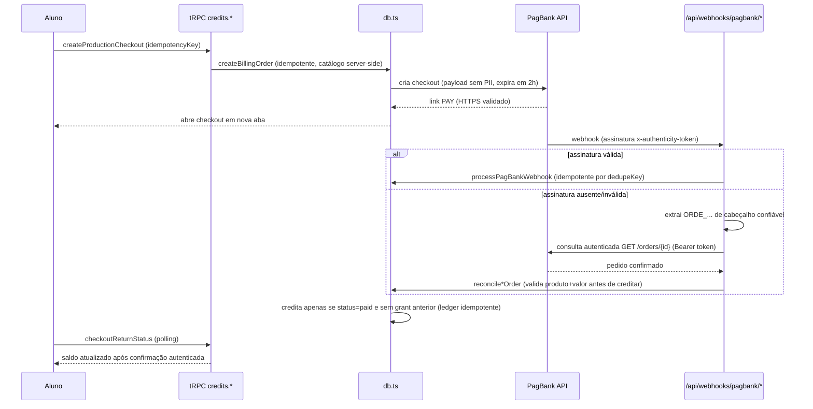
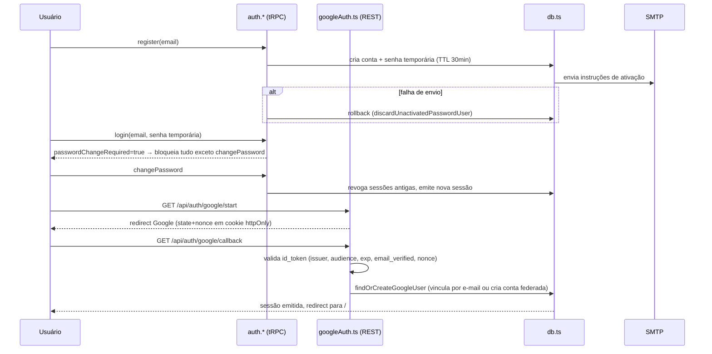

# Arquitetura — PPA Teórico / Tutor Adaptativo

## 1. Visão geral

Monólito full-stack TypeScript, SPA + API tipada, sem SSR:

- **Cliente**: React 19 + Vite 7, roteamento client-side com `wouter`, estado de servidor via TanStack Query + tRPC React Query bindings, UI Radix/shadcn + Tailwind CSS 4.
- **Servidor**: Express 4 hospedando um roteador **tRPC 11** único (`/api/trpc`, transformer `superjson`) mais um punhado de rotas REST específicas (webhooks de pagamento, OAuth, desafio de chave pública, health check).
- **Banco**: MySQL via Drizzle ORM 0.44 (driver `mysql2`).
- **Build**: `vite build` (client → `dist/public`) + `esbuild` (server → `dist/index.js`, bundle ESM single-file). Dev: `tsx watch` com Vite em modo middleware (HMR).
- **Testes**: Vitest, só em `server/**/*.{test,spec}.ts` (domínio, contratos de API, integração).
- **Gerenciador de pacotes**: pnpm 10.



## 2. Stack tecnológico

| Camada | Tecnologia |
|---|---|
| Linguagem | TypeScript 5.9 estrito, ESM |
| Frontend | React 19.2, Vite 7.1, wouter 3.3, TanStack Query 5, `@trpc/react-query`, Tailwind CSS 4, Radix UI, shadcn/ui ("new-york"), react-hook-form + Zod 4, framer-motion, recharts, streamdown |
| Backend | Express 4.21, tRPC Server 11, Drizzle ORM 0.44 (MySQL/mysql2), google-auth-library, jose (uso legado), nodemailer |
| Banco | MySQL (confirmado por `drizzle.config.ts` → `dialect: "mysql"`) |
| Build | esbuild (server), Vite (client) |
| Testes | Vitest 2 |
| Pacotes | pnpm 10 |

## 3. Integrações externas

| Integração | Uso real | Observações |
|---|---|---|
| **LLM** (`server/_core/llm.ts`) | Geração de questões, feedback e avaliações (`server/domain/tutorLlm.ts`), modelo `gpt-5-mini`, API compatível com OpenAI Chat Completions, via proxy Forge (`BUILT_IN_FORGE_API_URL`/`_API_KEY`), retry com backoff exponencial. | Todas as saídas passam pela barreira `assertNoRagLeakage`. |
| **PagBank** (pagamentos) | Checkout hospedado, webhook com verificação HMAC + reconciliação server-to-server, Connect Token Challenge (par RSA 2048). Ambientes Sandbox/Produção totalmente segregados por variável de ambiente e coluna `environment`. | Integração mais coberta por testes do projeto; ver `docs/backlog.md` para pendências de homologação. |
| **Google OAuth 2.0** | Login/vinculação de conta via `google-auth-library`, redirect URI fixo em produção. | Não usa o SDK de OAuth "Manus" — implementação própria. |
| **SMTP** (Nodemailer) | Ativação de conta e recuperação de senha, porta 465/TLS implícito obrigatório. | Deliverability para Gmail é uma pendência ativa (ver backlog). |
| **Armazenamento de objetos** | Proxy simples via Forge/Manus (`GET/PUT` com URL pré-assinada), não via AWS SDK direto. | `@aws-sdk/client-s3` e `@aws-sdk/s3-request-presigner` estão instalados mas **não são usados** em nenhum arquivo — dependência morta. |
| **Plataforma "Manus"** | Origem do template do projeto (`template.json`, id `web-db-user`). SDK server-side (`server/_core/sdk.ts`, `oauth.ts`, `dataApi.ts`, `heartbeat.ts`, `notification.ts`, `imageGeneration.ts`, `voiceTranscription.ts`, `map.ts`, `systemRouter.ts`) majoritariamente **não conectado** à aplicação real — ver seção 5. |
| Analytics de terceiro (Umami) | Script injetado em `client/index.html` via placeholders `%VITE_ANALYTICS_ENDPOINT%`/`%VITE_ANALYTICS_WEBSITE_ID%`. | Mecanismo de substituição desses placeholders não está nas configs deste repositório — provavelmente feito pela camada de hospedagem. |

## 4. Estrutura de pastas

```
client/src/
  pages/          # Telas: AuthScreen, Home (shell), StudyWorkspace, ReadinessDashboard,
                  # PlansPage, StudentProfilePage, AdminAnalyticsDashboard,
                  # CanonicalConceptMapPage, PoliciesPage, NotFound
  components/     # PasswordChangePanel, PoliciesCornerLink, OfficialBrandLogo, ErrorBoundary
                  # (+ resíduos de template: AIChatBox, DashboardLayout*, ManusDialog, Map — ver backlog)
  components/ui/  # Biblioteca shadcn/ui
  _core/hooks/    # useAuth
  hooks/          # usePlatformActivity, useMobile, usePersistFn, useComposition
  lib/            # trpc.ts (cliente tRPC), utils.ts
  contexts/       # ThemeContext

server/
  _core/          # Infraestrutura genérica: trpc.ts, context.ts, cookies.ts, env.ts, index.ts (bootstrap Express),
                  # vite.ts (dev/prod serving), llm.ts (único módulo "Manus" ativamente usado),
                  # storageProxy.ts (rota /manus-storage/*)
                  # + residuais não conectados: sdk.ts, oauth.ts, dataApi.ts, heartbeat.ts,
                  #   notification.ts, imageGeneration.ts, voiceTranscription.ts, map.ts, systemRouter.ts
  domain/         # Regras de negócio puras e testáveis: learning, assessmentMatrix, studyProgram,
                  # billing, cache, cacheWarmup, email, homologationAudit, pagbankSandbox,
                  # password, publicCanonicalCatalog, rag, tutorLlm, tutorLlmSafety, adminAnalytics
  routers.ts      # Roteador tRPC principal (appRouter)
  db.ts           # Camada de dados + orquestração transacional (1727 linhas)
  auth.ts / googleAuth.ts / pagbankWebhook.ts / pagbankConnectChallenge.ts / adminAnalyticsDb.ts

drizzle/
  schema.ts       # Schema único (35 tabelas)
  0000..0019.sql  # Migrações
shared/
  types.ts, const.ts, _core/errors.ts   # Tipos e constantes compartilhados client/server

scripts/          # Automação operacional (seed, warm-cache, smoke tests, captura de UI) — ver how-to.md
docs/exec-plan/   # Histórico de planejamento/execução de features passadas (não normativo)
```

## 5. A plataforma "Manus" e código residual

O projeto foi gerado a partir de um template da plataforma Manus (`template.json`, id `web-db-user`). Vestígios visíveis: `vite-plugin-manus-runtime`, `client/public/__manus__/`, `server/_core/types/manusTypes.ts`, um "Manus Debug Collector" ativo só em dev (`vite.config.ts`) que grava logs de console/rede/replay em `.manus-logs/*.log`.

**Importante para manutenção futura**: a maior parte desse SDK server-side está **desconectada** da aplicação real:
- `registerOAuthRoutes` (login "Manus") nunca é chamado em `server/_core/index.ts`.
- `ManusDialog.tsx` não é importado por nenhuma página.
- `systemRouter` (heartbeat/notifyOwner via tRPC) não está montado em `appRouter`.
- `heartbeat.ts`, `notification.ts`, `dataApi.ts`, `map.ts`, `voiceTranscription.ts`, `imageGeneration.ts` não são importados por nenhum outro arquivo do produto.

A autenticação real é 100% própria (e-mail/senha + Google OAuth, sessão por cookie opaco). O único módulo `_core` de fato usado pelo produto é `llm.ts` (proxy de LLM), além da infraestrutura genérica de tRPC/Express e do proxy de storage. Recomenda-se decidir explicitamente (remover vs. documentar como reservado) o destino desse código morto — ver `docs/backlog.md`.

## 6. Fluxos ponta a ponta (sequência)

### 6.1 Resposta a uma questão



### 6.2 Pagamento PagBank (checkout → webhook → reconciliação → crédito)



### 6.3 Autenticação (local + Google)



## 7. Variáveis de ambiente

Carregadas via `dotenv` a partir da raiz do projeto. Não há `.env.example` versionado (recomendação de backlog).

| Variável | Domínio | Obrigatória para |
|---|---|---|
| `DATABASE_URL` | Core | Conexão MySQL (Drizzle, drizzle-kit, todos os scripts) |
| `PORT` | Core | Porta do Express (default 3000, com fallback automático) |
| `NODE_ENV` | Core | `development`/`production` — decide middleware Vite vs. estático |
| `BUILT_IN_FORGE_API_URL`, `BUILT_IN_FORGE_API_KEY` | LLM/Storage | Proxy de LLM (`llm.ts`) e storage (`storage.ts`/`storageProxy.ts`) |
| `SMTP_HOST`, `SMTP_PORT`(=465), `SMTP_SECURE`(=true), `SMTP_USER`, `SMTP_PASSWORD`, `SMTP_CLIENT_NAME`, `EMAIL_FROM` | E-mail | Ativação/recuperação de senha |
| `GOOGLE_OAUTH_CLIENT_ID`, `GOOGLE_OAUTH_CLIENT_SECRET` | Auth | Login Google |
| `PAGBANK_SANDBOX_TOKEN`, `PAGBANK_PRODUCTION_TOKEN` | Pagamentos | Checkout/webhook por ambiente |
| `PAGBANK_HOMOLOGATION_MODE`, `PAGBANK_PRODUCTION_HOMOLOGATION_MODE`, `PAGBANK_PRODUCTION_COMMERCIAL_MODE` | Pagamentos | Flags de habilitação por fase comercial |
| `PAGBANK_CONNECT_PUBLIC_KEY[_BASE64]`, `PAGBANK_CONNECT_PRIVATE_KEY[_BASE64]`, `PAGBANK_CONNECT_KEY_CREATED_AT` | Pagamentos | Connect Token Challenge (par RSA) |
| `JWT_SECRET`, `VITE_APP_ID`, `OAUTH_SERVER_URL`, `OWNER_OPEN_ID` | Legado "Manus" | Usados apenas pelo SDK OAuth/heartbeat não conectado — candidatos a remoção |
| `VITE_ANALYTICS_ENDPOINT`, `VITE_ANALYTICS_WEBSITE_ID` | Analytics | Script Umami injetado no HTML |
| `PPA_BASE_URL`, `OCR_CONCURRENCY`, `RUN_SMTP_LIVE`, `RUN_SMTP_LIVE_DELIVERY_TEST`, `RUN_PAGBANK_PIX_KEY_VALIDATION`, `PAGBANK_ENABLE_PRODUCTION_AUTH_PROBE` | Scripts/Testes | Automação e testes que tocam serviços reais |

## 8. Deploy e CI/CD

Não há `Dockerfile`, workflows de CI (`.github/workflows` ou equivalente), nem arquivos de infraestrutura como código (`render.yaml`, `fly.toml`, `vercel.json` etc.) neste repositório. Domínios permitidos em `vite.config.ts` (`*.manus*.computer`) e o redirect URI fixo do Google OAuth (`ppa.simulados.apia.app.br`) indicam fortemente que o build/deploy é orquestrado pela infraestrutura própria da plataforma Manus, fora do controle de versão deste repositório. Isso deve ser confirmado operacionalmente e documentado à parte (ver backlog).
