# Modelo de Dados / ER — PPA Teórico / Tutor Adaptativo

> Engenharia reversa de `drizzle/schema.ts` (809 linhas, dialeto **MySQL**, driver `mysql2`). `drizzle/relations.ts` está vazio — o projeto **não usa** `relations()` do Drizzle; todos os vínculos abaixo vêm de `foreignKey()`/`.references()` no schema, complementados por referências lógicas sem constraint (destacadas na seção 4). Evolução via 20 migrações (`drizzle/0000`–`0019`).

## 1. Diagrama ER (Mermaid — foreign keys declaradas)

```mermaid
erDiagram
    USERS ||--o| STUDENT_PROFILES : "1:1 (PK=FK)"
    USERS ||--o{ ANAC_EXAM_ATTEMPTS : "1:N"
    USERS ||--o{ AUTH_SESSIONS : "1:N"
    USERS ||--o{ AUTH_PASSWORD_DELIVERIES : "1:N"
    USERS ||--o{ PLATFORM_ACCESS_SESSIONS : "1:N"
    USERS ||--o| STUDENT_READINESS_MAPS : "1:1 (unique)"
    USERS ||--o{ READINESS_MAP_VERSIONS : "1:N"
    USERS ||--o{ STUDENT_CONCEPT_READINESS : "1:N"
    USERS ||--o{ STUDY_SESSIONS : "1:N"
    USERS ||--o{ STUDY_QUESTIONS : "1:N"
    USERS ||--o| STUDENT_STUDY_PROGRAMS : "1:1 (unique)"
    USERS ||--o{ LEARNING_EVENTS : "1:N"
    USERS ||--o{ STUDY_PLANS : "1:N"
    USERS ||--o{ PROGRESS_ASSESSMENTS : "1:N"
    USERS ||--o{ IN_APP_NOTIFICATIONS : "1:N"
    USERS ||--o| CREDIT_BALANCES : "1:1 (PK=FK)"
    USERS ||--o{ CREDIT_LEDGER : "1:N"
    USERS ||--o{ BILLING_ORDERS : "1:N"
    USERS ||--o{ PAYMENT_ATTEMPTS : "1:N"
    USERS ||--o{ HOMOLOGATION_AUDIT_EVENTS : "1:N (actorUserId)"

    COURSE_CATALOG_VERSIONS ||--o{ CANONICAL_CONCEPTS : "RESTRICT"
    COURSE_CATALOG_VERSIONS ||--o{ KNOWLEDGE_SOURCES : "RESTRICT"
    COURSE_CATALOG_VERSIONS ||--o{ SHARED_QUESTION_CACHE : "RESTRICT"
    COURSE_CATALOG_VERSIONS ||--o{ STUDENT_READINESS_MAPS : "RESTRICT"
    COURSE_CATALOG_VERSIONS ||--o{ STUDENT_STUDY_PROGRAMS : "RESTRICT"

    CANONICAL_CONCEPTS ||--o{ STUDENT_CONCEPT_READINESS : "RESTRICT"
    CANONICAL_CONCEPTS ||--o{ SHARED_QUESTION_CACHE : "RESTRICT"

    KNOWLEDGE_SOURCES ||--o{ KNOWLEDGE_CHUNKS : "CASCADE"
    KNOWLEDGE_SOURCES ||--o{ KNOWLEDGE_CHUNK_TERMS : "CASCADE"
    KNOWLEDGE_SOURCES ||--o{ SHARED_QUESTION_CACHE : "RESTRICT (ragSourceId)"
    KNOWLEDGE_CHUNKS ||--o{ KNOWLEDGE_CHUNK_TERMS : "CASCADE"

    SHARED_QUESTION_CACHE ||--o{ STUDY_QUESTIONS : "RESTRICT (cacheQuestionId)"

    STUDENT_READINESS_MAPS ||--o{ READINESS_MAP_VERSIONS : "CASCADE"

    STUDY_SESSIONS ||--o{ STUDY_QUESTIONS : "CASCADE"
    STUDY_QUESTIONS ||--|| LEARNING_EVENTS : "1:1 (RESTRICT, unique questionId)"

    BILLING_ORDERS ||--o{ PAYMENT_ATTEMPTS : "CASCADE"
    BILLING_ORDERS ||--o{ PAYMENT_WEBHOOK_EVENTS : "SET NULL"
    BILLING_ORDERS ||--o{ HOMOLOGATION_AUDIT_EVENTS : "SET NULL"
    LLM_PRICING_RULES ||--o{ LLM_USAGE_EVENTS : "SET NULL"
```

## 2. Inventário de tabelas

### 2.1 Identidade, autenticação e conta

**`users`** — conta raiz. `id` int PK autoincrement; `openId` varchar(64) UNIQUE; `name`, `email` varchar(320) UNIQUE; `passwordHash`; `googleSubject` UNIQUE nullable; `passwordChangeRequired` boolean; `temporaryPasswordIssuedAt`/`ExpiresAt`; `loginMethod` (`password`|`password_google`|`google`); `role` enum(`user`,`admin`,`homologation`); timestamps.

**`student_profiles`** — 1:1 com `users` (PK = FK `userId`, `ON DELETE CASCADE`). `dateOfBirth`, `gender` enum(M,F,NB), `city`, `stateUf`(2), `theoreticalCourseProvider`.

**`anac_exam_attempts`** — `id` PK; `userId` FK CASCADE; `examDate`; notas `metScore/regScore/navScore/mecScore/tvoScore`; `approved`. Índice (userId, examDate).

**`auth_sessions`** — tokens de sessão. `tokenHash` UNIQUE; `expiresAt`; `revokedAt` nullable (soft-revoke).

**`auth_login_attempts`** — anti-bruteforce, sem FK a `users` (correlaciona por `emailHash`/`ipHash`).

**`auth_password_deliveries`** — auditoria de emissão de senha temporária (nunca a senha em si). `purpose` enum(activation, password_reset); `status` enum(issued, sent, failed); `smtpAcceptedAt`, `smtpMessageIdHash`, `failureCode`.

### 2.2 Telemetria operacional (globais, sem `userId` na maioria)

- **`platform_access_sessions`** — uso agregado por usuário (sem IP/UA/conteúdo).
- **`operation_metric_events`** — métricas técnicas mínimas (`component`, `operation`, `outcome`, `durationMs`, `errorCode`).
- **`llm_pricing_rules`** / **`llm_usage_events`** — preço vigente por modelo/período; uso técnico de LLM (tokens, latência, custo estimado) **sem prompts/respostas**.
- **`runtime_metric_snapshots`** — leituras do processo Node.
- **`external_health_checks`** — disponibilidade só existe quando uma sonda externa grava aqui.
- **`operational_cost_entries`** — despesas reais lançadas manualmente por admin.

### 2.3 Catálogo pedagógico / RAG (compartilhado, não por usuário)

- **`course_catalog_versions`** — versão imutável do currículo (`sourceChecksum`, `sourceMapJson`, `sourcePlanMarkdown`). Raiz de FKs `RESTRICT`.
- **`canonical_concepts`** — 872 conceitos; `matterId/Name`, `chapterId/Name`, `topicId/Name`, `priority` enum(P1–P4), `gapScore`, `recentIncidence`.
- **`knowledge_sources`** — documentos-fonte indexados; `status` enum(indexing, ready, failed); `chunkCount`.
- **`knowledge_chunks`** — trechos extraídos (`content`, `charCount`, `ordinal`, `sourcePath`).
- **`knowledge_chunk_terms`** — índice invertido ponderado (token→chunk), motor de recuperação léxica (sem embeddings).
- **`shared_question_cache`** — cache pedagógico global. `questionSignature` UNIQUE (hash determinístico); `status` enum(approved, retired — soft-retirement, nunca apagado); `feedbackCorrect/Incorrect/TeachMarkdown`; contadores de entrega/acerto/erro; `conceptIdsJson` para questões multiconceito (regra transversal REG).

### 2.4 Progresso do aluno (isolado por `userId`)

- **`student_readiness_maps`** — mapa consolidado 1:1 por aluno (`mapJson`, `checksum`, `integrityStatus` enum(valid, recoverable, blocked), `currentVersion`).
- **`readiness_map_versions`** — log append-only de versões (`patchJson` sempre; `snapshotJson` a cada 20 versões); `eventId` UNIQUE correlacionado 1:1 (sem FK) a `learning_events.id`.
- **`student_concept_readiness`** — célula de estado aluno×conceito. `currentState` enum `learningStates` (10 valores, ver seção 3); contadores extensos de tentativas/revisões; `reviewDueAt`, `reviewEligibleAfterQuestion`.
- **`study_sessions`** — sessão ativa (`mode` enum(diagnostic, simulado, tutor); `matrixJson`; `status` enum(active, paused, completed)).
- **`study_questions`** — questão individual entregue; `questionNumber` sequencial por aluno; `matrixSlot`; `pedagogicalAction` enum(new, immediate_review, spaced_review); `cacheQuestionId` FK RESTRICT opcional; `status` enum(presented, answered, retired).
- **`student_study_programs`** — porta de entrada diagnóstica, 1:1 por aluno (`diagnosticStatus` enum(active, mode_selection, completed); `selectedMode` enum(simulado, tutor) nullable; `diagnosticPlanJson`).
- **`learning_events`** — **ledger imutável** de eventos pedagógicos, 1:1 com `study_questions` (`questionId` UNIQUE, FK RESTRICT); `eventType` enum de 7 valores; `classification` enum(correct, incorrect, me_ensine).
- **`study_plans`** — planos versionados por aluno (append-only, `uniqueIndex(userId, version)`).
- **`progress_assessments`** — avaliações de marco (`assessmentType` enum(partial_20, diagnostic_100), append-only).
- **`in_app_notifications`** — `kind` enum(review_due, assessment_ready, integrity_attention); `dedupeKey` UNIQUE por usuário; `readAt` nullable.

### 2.5 Créditos e cobrança

- **`credit_balances`** — saldo materializado, 1:1 (PK=FK `userId`). Projeção de leitura; fonte de verdade é o ledger.
- **`credit_ledger`** — **livro-caixa imutável** (nunca UPDATE/DELETE). `entryType` enum de 6 valores; `balanceAfter` (snapshot); `idempotencyKey` UNIQUE global; `uniqueIndex(userId, referenceType, referenceId)`.
- **`billing_orders`** — pedido interno. `status` enum(draft, pending, paid, failed, cancelled, expired); `environment` enum(sandbox, production) — **adicionada só na migração 0019**; `amountCents` sempre em centavos, nunca vindo do cliente; `referenceId` UNIQUE.
- **`payment_attempts`** — tentativa no provedor; `status` enum de 8 valores; hashes de payload (nunca payload bruto); `idempotencyKey` UNIQUE global.
- **`payment_webhook_events`** — dedupe de webhooks (`uniqueIndex(provider, dedupeKey)`); `orderId` FK `SET NULL`; `processingStatus` enum de 5 valores.
- **`homologation_audit_events`** — evidência sanitizada de auditoria PagBank; `operation` enum de 6 valores; `outcome` enum(started, succeeded, failed, ignored); `orderId` FK `SET NULL`; `exportedAt` nullable.

## 3. Enums centrais

| Campo | Valores |
|---|---|
| `users.role` | user, admin, homologation |
| `student_concept_readiness.currentState` (`learningStates`) | not_presented, presented, taught, independent_correct, partial_consolidation, partial_adequate, partial_strong, partial_confirmed, confirmed, relearning |
| `canonical_concepts.priority` | P1, P2, P3, P4 |
| `shared_question_cache.status` | approved, retired |
| `student_readiness_maps.integrityStatus` | valid, recoverable, blocked |
| `study_sessions.mode` / `study_questions.studyMode` | diagnostic, simulado, tutor |
| `student_study_programs.diagnosticStatus` | active, mode_selection, completed |
| `learning_events.eventType` | independent_correct, independent_incorrect, teach_requested, immediate_review_correct, immediate_review_incorrect, spaced_review_correct, spaced_review_incorrect |
| `learning_events.classification` | correct, incorrect, me_ensine |
| `billing_orders.status` | draft, pending, paid, failed, cancelled, expired |
| `*.environment` (billing/payment/webhook/homologation) | sandbox, production |
| `payment_attempts.status` | created, waiting, in_analysis, paid, declined, canceled, failed, expired |
| `credit_ledger.entryType` | trial_grant, purchase_grant, question_debit, adjustment_grant, adjustment_debit, refund_debit |

## 4. Associações lógicas sem FK declarada

Usadas nas queries via `eq()`/`inArray()`, mas sem constraint no schema — integridade garantida apenas pela aplicação:

- `study_sessions.programId` → `student_study_programs.id`
- `study_sessions.currentQuestionId` → `study_questions.id`
- `student_study_programs.diagnosticSessionId` → `study_sessions.id`
- `readiness_map_versions.eventId` ⇄ `learning_events.id`
- `study_plans.sourceMapVersion` / `progress_assessments.mapVersion` / `learning_events.mapVersion` → `student_readiness_maps.currentVersion` (referência temporal, não estrutural)
- `in_app_notifications.referenceId` / `credit_ledger.referenceId` → referências polimórficas, resolvidas por `referenceType`

## 5. Isolamento multi-tenant lógico

Não há isolamento de infraestrutura (single-tenant de banco) nem RLS nativo do MySQL — o isolamento é garantido inteiramente pela camada de aplicação: toda query de leitura/escrita em `server/db.ts` inclui `eq(<tabela>.userId, userId)`. `ON DELETE CASCADE` consistente em todas as tabelas de dados pessoais (exclusão de conta remove todo o histórico). Dados verdadeiramente compartilhados entre alunos (por design, para reuso de custo): catálogo, RAG e cache pedagógico.

## 6. Padrões de modelagem notáveis

1. **Ledger imutável + saldo materializado** — `credit_ledger` (append-only, com `idempotencyKey` duplo) alimenta `credit_balances` (projeção), com lock pessimista (`SELECT ... FOR UPDATE`) para atomicidade.
2. **Event sourcing parcial com checkpoints** — `learning_events` como log imutável; `readiness_map_versions` grava delta a cada evento e snapshot completo a cada 20 versões.
3. **Checksums de integridade** — `student_readiness_maps.checksum` e `readiness_map_versions.checksum`, com estado de degradação explícito (`integrityStatus`).
4. **Soft-state em vez de exclusão física** — cache retirado (`status=retired`), sessão revogada (`revokedAt`), notificação lida (`readAt`), evidência exportada (`exportedAt`).
5. **Idempotência onipresente** — chaves de idempotência em praticamente toda tabela transacional.
6. **Isolamento sandbox/produção tardio e reforçado** — coluna `environment` introduzida na migração mais recente (0019) em quatro tabelas simultaneamente, endurecendo a segregação entre ambientes de pagamento.
7. **Cache RAG lexical (não vetorial)** — reuso chaveado por (`catalogVersionId`, `conceptId`, `ragSourceId`, `status`), recuperação por índice invertido ponderado por termo.
8. **RESTRICT vs. CASCADE como sinal de criticidade** — conteúdo mestre/histórico pedagógico protegido por `RESTRICT`; dados pessoais do próprio usuário caem em cascata ao excluir a conta (sem anonimização/retenção observada).
